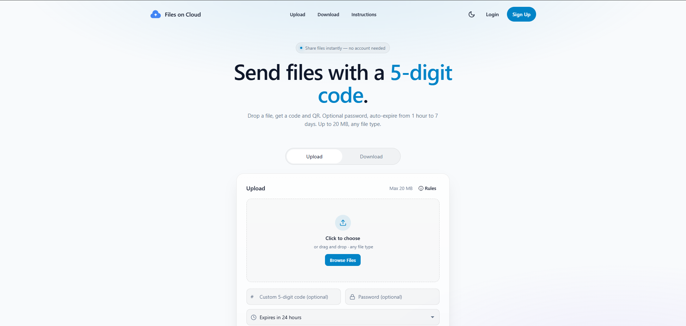
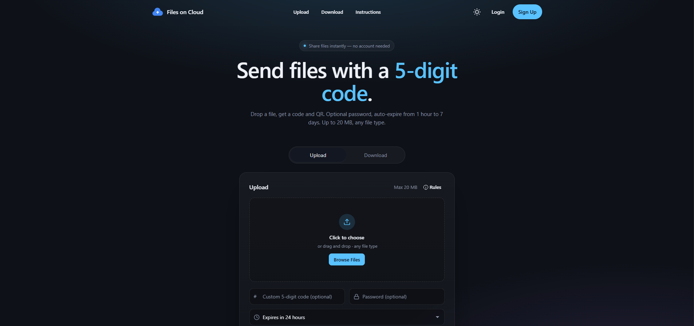
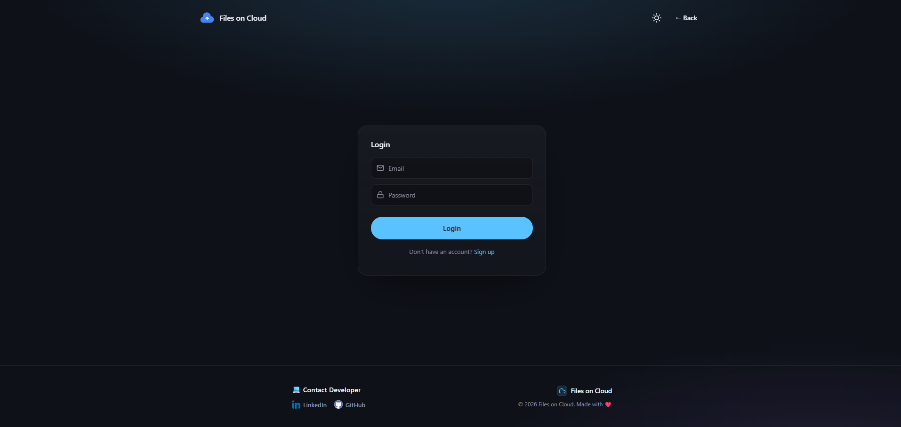
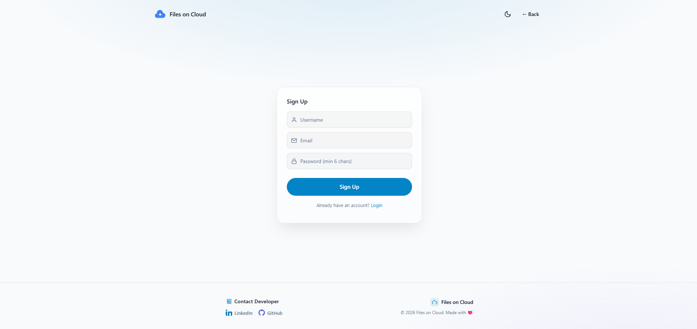
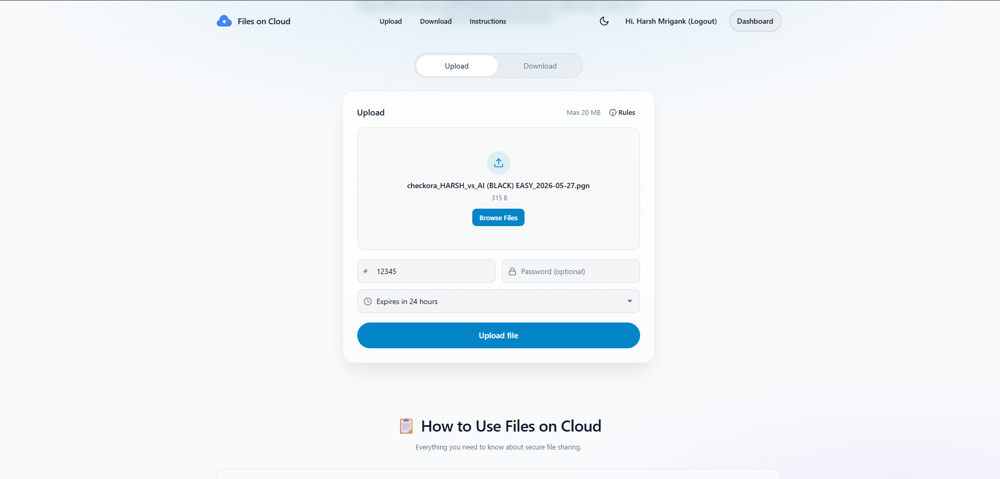
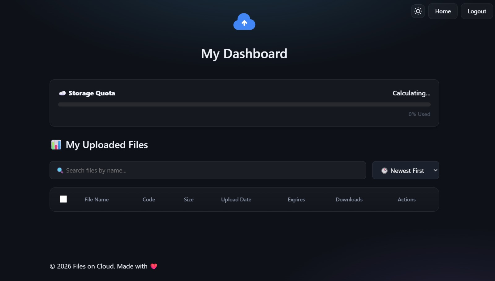

# 🗂️ Files-on-Cloud

[]()
[]()
[]()
[]()


> A modern, secure, and lightning-fast cloud file storage and sharing web application. Upload, protect, and share your files seamlessly with customizable expirations, password-protected downloads, and real-time analytics.

**🔗 Live Demo:** [https://files-on-cloud.onrender.com](https://files-on-cloud.onrender.com)  
*⚙️ (Note: The app may load slowly initially as the backend is hosted on Render's free tier).*

---

## ✨ Features & Capabilities

*   📤 **High-Speed File Uploads** — Drag-and-drop or select any file (up to 20MB) to upload securely to the cloud.
*   🔒 **Password-Protected Shares** — Add a layer of security by encrypting your download links with custom passwords.
*   ⏱️ **Flexible Expirations** — Configure files to expire and auto-delete after `1 hour`, `6 hours`, `24 hours`, or `7 days`.
*   📊 **Real-Time Download Analytics** — Track exact download counts and monitor the latest 10 download logs (including IP addresses, user agents, and timestamps).
*   📷 **Instant QR Code Generation** — Share your files instantly with visual QR codes that users can scan to download on mobile.
*   🛡️ **State-of-the-Art Security** — Pre-configured protection layers to secure developer and user data.
    *   **Advanced Rate-Limiting**: IP-based rate limiting (100 requests per 15 mins) and specialized strict Auth rate limiting (5 failed attempts per 15 mins).
    *   **File Type Safety**: Built-in blocklists rejecting dangerous executable extensions (`.exe`, `.jar`, `.msi`, `.swf`) to prevent server abuse.
    *   **Sanitization Safeguards**: Filename sanitization protecting against Path Traversal and HTTP Header Injections.
    *   **Auto-Cleanup Cron**: An hourly background daemon (`node-cron`) that automatically purges expired files from both the disk and database.

---

## 📂 Project Architecture

The project has been built using a clean, separation-of-concerns architecture dividing static, responsive UI components from robust, secure REST APIs.

```bash
Files-on-Cloud/
│
├── backend/                  # Full Node.js Express server
│   ├── middleware/
│   │   └── auth.js           # JWT Authentication validator
│   ├── models/
│   │   ├── File.js           # File schema with bcrypt password hashing
│   │   └── User.js           # User schema with secure login methods
│   ├── routes/
│   │   ├── auth.js           # Signup, Login, and profile endpoints
│   │   ├── download.js       # Secured file-download flow with password validation
│   │   └── upload.js         # Uploader, renamer, remover, and analytics engines
│   └── server.js             # Bootstrap server, Cron-job cleanup, rate limiters
│
├── public/                   # Beautiful responsive frontend UI
│   ├── auth.html             # Sleek Login & Signup page
│   ├── dashboard.html        # Comprehensive user console for file management
│   ├── index.html            # Main file upload landing page
│   ├── script.js             # Client-side API interactions and logic
│   ├── style.css             # Harmonious theme variables and visual styling
│   └── theme.js              # Active light/dark mode switcher
│
├── uploads/                  # Temporary local storage for files (created dynamically)
│
├── .env.example              # Template configuration for environment variables
├── .gitignore                # Filesystem exclusions
├── LICENSE                   # Project license
├── package.json              # App scripts and dependencies
└── README.md                 # Project documentation
```

---

## 🔌 API Endpoints Reference

### 🔑 Authentication API
| Method | Endpoint | Headers | Request Body | Description |
| :--- | :--- | :--- | :--- | :--- |
| `POST` | `/api/auth/signup` | None | `{username, email, password}` | Registers a new user and returns a JWT token. |
| `POST` | `/api/auth/login` | None | `{email, password}` | Validates user credentials and returns a session JWT. |
| `GET` | `/api/auth/me` | `Authorization: Bearer <token>` | None | Returns active user profile information. |

### 📤 File Upload & Management API
| Method | Endpoint | Headers | Request / Params | Description |
| :--- | :--- | :--- | :--- | :--- |
| `POST` | `/api/upload` | `Authorization: Bearer <token>` (Optional) | `Multipart FormData` (`file`, `code`, `password`, `expiration`, `customName`) | Securely uploads a file. Returns download link & QR code. |
| `GET` | `/api/info/:code` | None | URL Param `code` (5-digit) | Retrieves file details (size, expiration, password-presence) without downloading. |
| `GET` | `/api/analytics/:code` | `Authorization: Bearer <token>` | URL Param `code` | Returns the 10 most recent download logs and download counts (owner-locked). |
| `GET` | `/api/files/me` | `Authorization: Bearer <token>` | None | Retrieves all files uploaded by the active user. |
| `PUT` | `/api/files/:code/rename` | `Authorization: Bearer <token>` | URL Param `code`, body `{customName}` | Renames a user-owned file while preserving its original extension. |
| `DELETE` | `/api/files/:code` | `Authorization: Bearer <token>` | URL Param `code` | Deletes a user-owned file from both the database and the filesystem. |

### 📥 Public Share API
| Method | Endpoint | Query Parameters | Description |
| :--- | :--- | :--- | :--- |
| `GET` | `/download/:code` | `?password=your_password` (Optional) | Serves the actual file download stream. Prompts for a password if the file is protected. |
| `GET` | `/api/health` | None | Server health status ping. |

---

## ⚙️ Setup & Local Running

### 🛠️ Prerequisites
Ensure you have the following installed:
*   [Node.js](https://nodejs.org/) (v14.0.0 or higher)
*   [MongoDB Atlas](https://www.mongodb.com/cloud/atlas) or a running local MongoDB database instance

### 📥 1. Clone & Install
Clone the repository and install all required node modules:
```bash
git clone https://github.com/priyansh13-c/Files-on-Cloud.git
cd Files-on-Cloud
npm install
```

### 🔑 2. Configure Environment Variables
Copy `.env.example` into `.env` at the root directory or inside the `/backend` folder:
```bash
# Create a .env file from the example
cp .env.example .env
```
Open `.env` and fill in the connection details:
```env
# MongoDB Connection (Atlas or local URL)
MONGO_URI=mongodb+srv://<username>:<password>@cluster.mongodb.net/<dbname>

# JWT Signing Secret (Generate a strong key)
# Command to generate: node -e "console.log(require('crypto').randomBytes(64).toString('hex'))"
JWT_SECRET=your_super_secret_jwt_key_here

# Server Port (Optional, defaults to 10002)
PORT=10002
```

### 🚀 3. Start the Server

*   **Production / Standard Execution:**
    ```bash
    npm start
    ```
*   **Development Mode (Auto-restart on change):**
    ```bash
    npm run dev
    ```

Once running, navigate to [http://localhost:10002](http://localhost:10002) to view the web application!

---

## 📸 UI Screenshots













## 🤝 Contributing

We welcome community contributions! Please read our [CONTRIBUTING.md](file:///d:/Open-Source/Nsoc/Files-on-Cloud/CONTRIBUTING.md) and check out the [CODE_OF_CONDUCT.md](file:///d:/Open-Source/Nsoc/Files-on-Cloud/CODE_OF_CONDUCT.md) guidelines.

---

## 📄 License

This project is licensed under the MIT License — see the [LICENSE](file:///d:/Open-Source/Nsoc/Files-on-Cloud/LICENSE) file for complete information.
